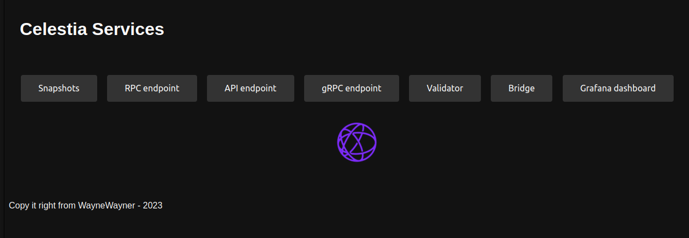

# Description
How to host a simple website with links to Snapshots, RPC, Validator, Grafana etc.

Example: https://celestia.waynewayner.de/


# Steps

1. Copy the celestia-website folder to your server
2. Edit the links inside the index.html according to your endpoints and validator address. I recommend nginx-proxy-manager if you want to use a domain.
3. Start the webserver. We use the python 3 http.server in this example.
   ```
   python3 -m http.server 8080 --directory /home/celestia/celestia-website/
   ```
4. Check if you can reach your server on http://\<yourIP/Domain>:8080
5. If it's working you can create a systemd service
   ```
   sudo nano /etc/systemd/system/celestia-website.service
   ```
   ```
   [Unit]
   Description=Celestia website
   After=network-online.target
   [Service]
   User=$USER
   ExecStart=python3 -m http.server 8080 --directory /home/celestia/celestia-website/
   Restart=on-failure
   RestartSec=3
   LimitNOFILE=4096
   [Install]
   WantedBy=multi-user.target
   ```
   Enable and start service
   ```
   sudo systemctl daemon-reload
   sudo systemctl enable celestia-website.service
   sudo systemctl start celestia-website.service
   ```
6. Done